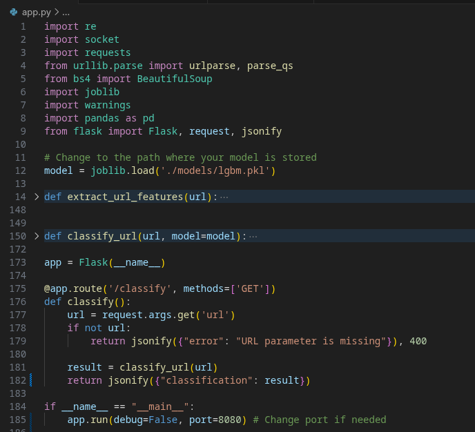
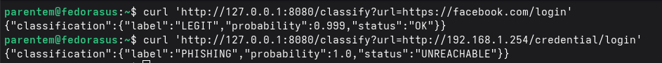
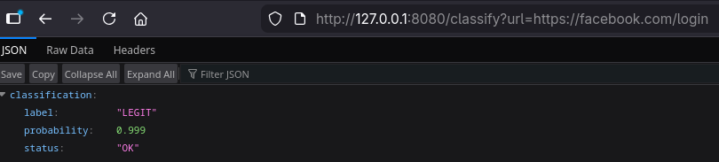

# Machine Learning Model - Training and Evaluation (CRISP-DM)

This is a machine learning model training project, following the 6 step CRISP-DM method. The business purpose of the model is to analyse user provided URL's and be able to provide a direct assessment, indentifying if they should be seen as potentially malicious (phishing, credential stealer...). 

Regular platforms for URL check's usually rely on previously available reports to assess the URL, while the proposed approach of using a ML model is able to provide an assessment based on paterns identified on the URL and webpage content. 

The model was trained using a tabular dataset available in https://www.kaggle.com/datasets/shashwatwork/phishing-dataset-for-machine-learning.

Guidance notes and context are provided directly on the jupyter noteboook files, along with the code. 
Different models were trained and made available in [models folder](models/).

The features used for these models can be checked in the [training](model_train.ipynb) or [deployment](deployment.ipynb) jupyter notebooks. These include features that require the URL to be fetched (HTTP GET), so have that in consideration in case you want to deploy locally. In case the URL is not reachable or down, the povided "extract_url_features" and "classify_url" functions ([deployment file](deployment.ipynb)) will still provide a model analysis, based only on the passive features.

## Example local deployment

These steps demonstrate the basic deployment of a Flask app that was made as a Proof-of-Concept for the model practical usage. 
Download the [app.py](app.py) and your model of choice. The best evaluation & testing results were obtained with [lgbm.pkl](models/lgbm.pkl) model.

Adjust the code for the correct model path and port for running the webapp. 

If everything is good, after running the app you should be able to use it either via terminal or browser. 
In my case I'm both running and testing from my machine (thus the loopback IP), but you can run the app or a different local server and fetch it from another computer.

